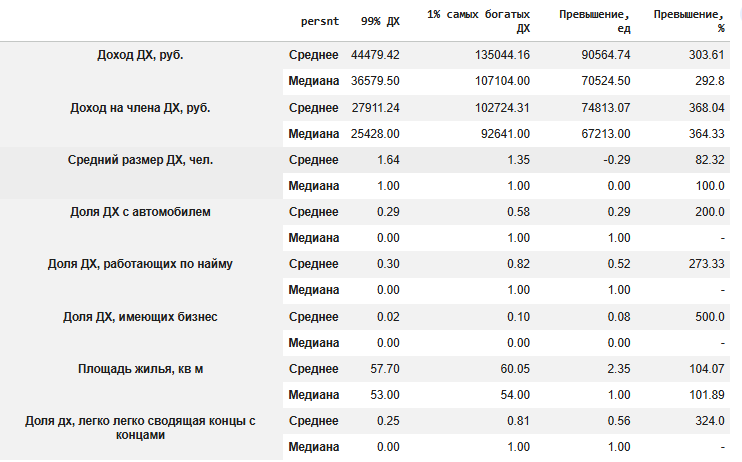
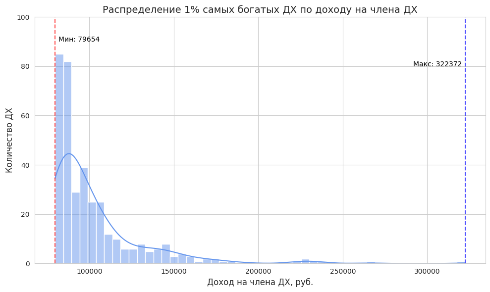
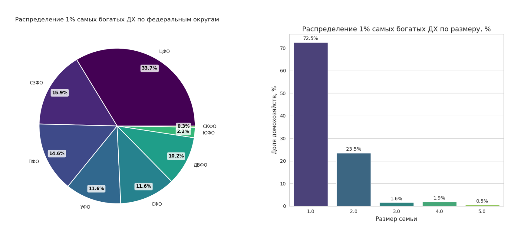

# Предобработка и исследовательский анализ данных (EDA): экономическое благосостояние домохозяйств России
Проект включает полный цикл работы с данными: очистку и трансформацию сырых данных, обработку пропусков и выбросов, разведочный анализ с визуализацией распределений и корреляций.

## 📊 Данные
 Фрагмент комплексного наблюдения условий жизни населения (Росстат).Содержит 37059 записей по 16 показателям: доходы домохозяйства, тип занятости, тип населенного пункта, регион.
 
**Цель:** выявить группы домохозяйств с высоким уровнем дохода для сегментации целевой аудитории. Ключевые метрики — совокупный доход домохозяйства и доход на одного члена.
Исследовать уровень жизни домохозяйств в России, выявить региональные различия, факторы благосостояния и выделить премиальный сегмент для бизнес-задач.

## 🔧 Часть 1. Предобработка данных

Реализуется подготовка данных для последующего аналитического исследования: обработка пропусков, проверка аномалий, расчет новых показателей.

### Этап 1. Загрузка и первичный анализ
Данные загружены из файла `data.xlsx` с помощью библиотеки Pandas.
- **Проведена обработка загруженных данных:** 
  - Варианты ответа `затрудняюсь ответить` с кодом `-7` заменены на пропуски.
  - Заданы типы данных: категориальные и числовые.
  - Проверено наличие дубликатов.

### Этап 2. Проверка наличия аномалий и неверно заполненых значений
  - **Корректность заполнения качественных переменных:**
    Проверено содержимое столбцов с бинарными и категориальными переменными - определены все уникальные значения. Ошибок в заполнении не обнаружено.
     
  - **Определение аномалий в количественных данных:**
    - Для количественных переменных `Доход домохозяйства, Средний доход на одного члена домохозяйства` построены ящики с усами:

     
     - Распределение имеет правостороннюю ассиметрию, что характерно для данных о доходах населения. Аномально высоких значений не обнаружено, данные заполнены корректно, не будут преобразованы.

### Этап 3. Обработка пропусков
- **Наличие пропусков** в категориальных переменных `[H04_04_01,  H02_03, H04_03]`
 
- **Способ заполнения:** 
  - Для заполнения пропусков использована **мода**, тк показатели качественные.
  - Переменная `H04_03 (Доходы)` удалена, т.к. содержит 93% пропусков.  

### Этап 4. Расчёт новых показателей (Feature Engineering)
- **Цель:** Создать новые признаки, которые могут быть полезны для анализа.
- **Новые показатели:**
  - `[below_PM]`= `[(df_1['DOX_mean'] < df_1['PM_DX_MES']).astype('int')]` - бинарная переменная, равная 1 для домохозяйств за границей бедности.
  - `['H04_01_03]` =`[ (df_1['H04_01_01'] + df_1['H04_01_02'] * 2).astype('category')]` - категориальная переменная, отражает тип занятости: 0 - нет источника дохода, 1 - только по найму, 2 - смешанный (работа по найму + бизнес) , 3 - только бизнес
  - `['size_DX]` = `[(df_1['DOX_mean']/df_1['DEN_NA_DUSHU']).round(0).astype(int)]` - размер домохозяйства, чел.

### Этап 5. Итоговый файл и сохранение
  - Выведена общая информация о данных
  -  Результаты сохранены с учетом типа переменных: библиотека `fastparquet`
   
  
## Результаты предобработки:
Датасет подготовлен к дальнейшему использованию:
- Размер выборки: 37059 записей, 19 признаков (добавлено 3 новых показателя).
- Пропуски обработаны, данные приведены к единому формату
- Датасет готов к исследовательскому анализу.
  
---

## 📈 Часть 2. Исследовательский анализ данных (EDA)

**Цель:** исследовать уровень жизни домохозяйств в России, выявить региональные различия, факторы благосостояния и выделить премиальный сегмент для бизнес-задач.

**Задачи:**
- Анализ распределения доходов и ключевых показателей
- Определение региональных и социально-экономических закономерностей
- Поиск взаимосвязей между признаками и уровнем дохода
- Сегментация домохозяйств с высоким уровнем дохода

### 📌 Содержание
- [Основные сведенья о данных](#-основные-сведения-о-данных)
- [Анализ распределения по доходу](#-анализ-распределения-по-доходу)
- [Географическое распределение](#-географическое-распределение-дх-по-уровню-дохода)
- [Взаимосвязь дохода с размером домохозяйства](#-взаимосвязь-дохода-с-размером-домохозяйства)
- [Анализ взаимосвязей](#-анализ-взаимосвязей)
- [Премиальный сегмент (Топ-1%)](#-премиум-сегмент-1-процент-самых-богатых-дх)
- [Бизнес-выводы](#-основные-результаты-анализа)
---
## 📋 Основные сведения о данных

Согласно описательной статистике половина домохозяйсвтв состоит из одного человека, имеет доход не более 36,8 тыс. руб, не работает по найму и не имеет свой бизнес, а также по субьективной оценке имеет трудности в сведении концов с концами. Таким образом большинство домохозяйств характерезуется достаточно низким уровнем жизни. Только у 30% есть личный автомобиль, 25% отмечают что им легко сводить концы с концами. В такой структуре данных является важным выявить сегменты возможных потребителей с достаточным уровнем благосостояния. 
Отметим что средний доход составляет 45,4 тыс. руб., в то время как медианный 36,8 тыс. руб., что указывает на правостароннюю ассиметрию. Данная гипотеза будет проверенна ниже. 

[Содержание](#-содержание)
## 📊 Анализ распределения по доходу

- В распределении ДХ по общему и среднедушевому уровню дохода наблюдается значительная правосторонняя ассиметрия, что подтверждает рассчитанное значение коэффициента ассиметрии. Коэффициент эксцесса указывает на то, что распределение является островершинным. Так, большинство домохозяйств сосредоточено в стороне низких значений дохода, выделяется ряд ДХ с аномально высокими значениями, превышающих 1,5 межквартильных растояния. Домохозяйства с высокими доходами, входящие в 1% самых богатых могут быть целевой аудиторией для бизнеса премиум сегмента.

- Рассмотрим распределение доходов в городских и сельских поселениях. Согласно ящикам с усами доходы в обоих типах населенных пунктов схожи, при этом в городе наблюдается больший разброс доходов. Согласно кумуляте распределения различия в доходах между городом и селом заметны только для 20% самых богатых ДХ.

- Большинство опрошенных ДХ (68%) не имеют источника дохода, 30% получают зарплату от наемной работы и только 2% получают доход от бизнеса. В зависимости от типа занятости наблюдаются различия в доходе, при этом для города они несколько выше. Наибольших доход среди городских ДХ наблюдается у тех, кто совмещает бизнес и найм, а среди сельских - у наемных рабочих.

[Содержание](#-содержание)
## 🗺️ Географическое распределение ДХ по уровню дохода

В этом разделе определим федеральные округа и типы поселений с высоким и низким уровнем дохода. 
- среди ФО наибольший медианный доход на одного человека наблюдается в СКФО, ДФО и ЦФО, а отстающим является УФО, медианный доход в котором составляет 23,6 тыс. руб. на человека.

- В разрезе типа поселения наибольший доход наблюдается в городских пунктах СКФО, ДФО и УФО.
Отметим особенность ЮФО и СЗФО, в которых заработов в селах превышает показатель в городах. Таким образом, не выявленно взаимосвязи между уровнем дохода и типом населенного пункта.
 - Минимальный уровень дохода на члена ДХ наблюдается в селах УФО.

[Содержание](#-содержание)
## 👨‍👨‍👧‍👦  Взаимосвязь дохода с размером домохозяйства
- Размер ДХ также может влиять на общий доход. Проверим теорию о том что у с ростом размера ДХ общий доход возрастает, а доход на одного члена домохозяйства снижается (предполагается наличие нетродуспособных детей в больших ДХ).
  - При увеличении размера ДХ с 1 до 3 членов медианный доход резко возрастает, однако далее остается стабильным при размере 4-7 человек, далее он снова увеличивается, но с меньшими темпами.
  - Наибольший доход на ДХ наблюдается для 10 человек.

- Медиана дохода на одного члена ДХ сокращается с увеличением размера ДХ. Так, максимальный медианный доход для одного человека. Отметим, что в этой группе также высокий разброс значений, коэффициент вариации составляет 50,3%, что говорит о неоднородности данных в группе.

[Содержание](#-содержание)
## 🔗 Анализ взаимосвязей
По рассматриваемым данным построена корреляционная матрица, тк большинство данных категориальные, не числовые, использован ранговый коэффийиент корреляции Спирмена.

- **Выявленные связи с уровнем дохода ДХ:**
  - прямая заметная с наличием автомобиля
  - прямая умеренная с работой по найму
  - прямая с размером дохозяйства - подтверждает выдвинутую выше теорию

[Содержание](#-содержание)
## 💎 Премиум сегмент 1 процент самых богатых ДХ

- На основе расчета 99 перцентиля выделим группу дмохозяйств с доходами выше, чем у 99% ДХ
`[df2['persnt']]`=`[(df2['DEN_NA_DUSHU']>(df2['DEN_NA_DUSHU'].quantile(0.99))).astype('int')]`
 - **Сравнение с остальными 99%:**
   - В группе 1% самых богатых медианный доход ДХ превышает аналогичный показатель остальной части опрошенных в 2,9 раз, а среднедушевой медианный доход выше в 3,6 раз.
   - Группа наиболее богатых ДХ отличается меньшими размерами ДХ, среди них более половины (58%) имеет автомобиль, в то время как для остальной части только треть (29%).
  - Отличия в типе занятости, среди богатых доля имеющих бизнес больше в 5 раз, а доля работающих по найму больше в 2,7 раз.

 - **Распределение по уровню дохода**
     - Минимальных доход в 1% группе с максимальными доходами на члена ДХ составляет 79,7 тыс. руб., а максимальный 323,4 тыс. руб.
     - Так же как и по всем данным наблюдается правосторонняя ассиметрия, медианный доход составляет 102,7 тыс. руб., а медианная 92,6 тыс.

 - **Распределение по ФО и размерам ДХ:**
   - Треть самых богатых ДХ проживает в ЦФО, еще околок 15% в СЗФО и ПФО, то есть центральной России.
   - Более распространены небольшие размеры ДХ по 1-2 человека, доля остальных менее 5%.
 
[Содержание](#-содержание)
---

## 💡 Основные результаты анализа

**1. Региональное неравенство.** Доходы домохозяйств дифференцированы: правосторонняя ассиметрия, 50% домохозяйств доход ниже 36,8 тыс. руб, на человека 25,5 тыс. руб. По среднедушевому медианному доходу лидируют города СКФО - 28,1 тыс. руб.

**2. Городской фактор не выявлен.** Жители сельской местности зарабатывают практически столько, различия заметны среди 20% самого богатого населения.

**3. Портрет премиального сегмента.** Топ-1% домохозяйств (≈370 записей) — это домохозяйства из 1-2 человек, проживающие в ЦФО и СЗФО, работающих по найму, чаще имеющих свой бизнес, владельцы авто. Их средний доход — 135 тыс. руб., на человека 107 тыс. руб.

**4. Ключевой фактор уровня дохода.** Наличие занятости и размер домохозяйства, наличие бизнеса и тип населенного пункта практически не влияет.

**Бизнес-рекомендации и точки роста.**
Наиболее перспективная аудитория для премиальных товаров и услуг — работающие одинокие люди и владельцы автомобилей, особенно в регионах Центральной России. Этот сегмент сочетает высокий доход и платежеспособность, что делает его приоритетным для расширения бизнеса. Рекомендуется сфокусировать маркетинговые кампании на данных группах.

### 🛠 Tech Stack
Python · Pandas · NumPy · Matplotlib · Seaborn · Scikit-learn

### 📂 Доступ к полному коду
Полный код проекта (Jupyter Notebook) и исходные данные предоставляются по запросу.

📩 **Запрос на доступ:** lenav.net2005@gmail.com

### 👩‍💻 Автор
Елена В.

